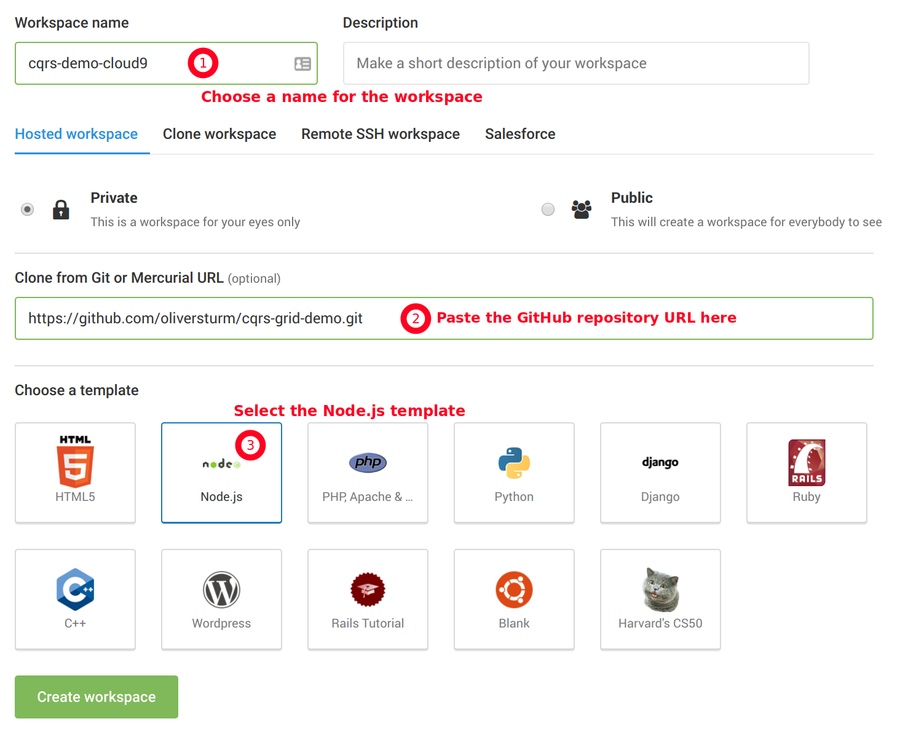
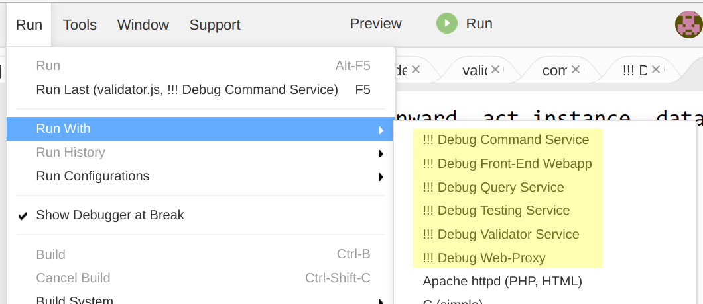

# Running in Cloud9

The [Cloud9 Online IDE](https://c9.io/) provides a quick and easy environment to try the demo project in just a few steps, and without requiring any setup on your own machine. Here's what you need to do:

### 1 - Sign in

Sign in to Cloud9 by [following this link](https://c9.io/login), create a new account or sign in with an existing GitHub or BitBucket account. Signing up unfortunately requires a credit card, but their free plan is the default and the Cloud9 people promise very sincerely not to charge you unless you decide to upgrade (**which is not required for purposes of this demo**).

### 2 - Create a new workspace

Using the Cloud9 dashboard, create a new workspace. Fill out the form with these details:

* *Workspace name*: Decide for yourself
* *Clone from Git or Mercurial URL*: Paste the repository from GitHub: https://github.com/oliversturm/cqrs-grid-demo.git 
* *Choose a template*: Select the *Node.js* template.



Click *Create Workspace* and sit back for a moment while Cloud9 does its job.

### 2a - Switch to the desired branch

In the terminal window, you have access to the `git` command line tool. If you want to work with a repository branch other than *Master*, you need to issue these commands:

```
git checkout <branch>
git clean -df
```

`<branch>` must be a valid branch name, for instance `knockout-frontend`. [Follow this link](https://github.com/oliversturm/cqrs-grid-demo/branches) to see all the branches of the demo project.

**Note** that the `git clean` command isn't strictly necessary at all times. It is meant to clean up files and directories from the workspace that don't exist in the branch you're switching to. 

### 3 - Prepare the project

Once the IDE comes up, you see a terminal panel at the bottom of the browser window, with a title starting with `bash`. This is your command line terminal. Enter the following command to prepare the environment for the demo project.

**Note that the command starts with `<dot> <space>`. Take care to enter it exactly like this.**

```
. prepare-cloud9.sh
```

The command might take up to a minute to complete and you will see some output, ending in a few instructions. Browse through the output to see if there's anything that looks like a horrible error message. If you can't see anything like that, chances are the preparation worked correctly.

As a final step specific to Cloud9, set the sharing options as described in the instructions in the terminal panel.

**Take a note** of the URL shown at the end of the instructions in the terminal. You will need this for the browser in a moment. You can also copy this URL from the Share window, right next to the check mark you set for public access.

### 4 - Run the demo

Similar to the main [README](../README.md) instructions for the demo, you need to install required modules now by running this command in the terminal:

```
make modules-install
```

When the module installation completes, you can run the demo using the configuration without docker:

```
make run-without-docker
```

Finally you can navigate to the URL of your running application, which you should have saved at the end of step 3 above.

**Note**: In order to stop the demo processes, you can use the command `make stop-run-without-docker`, which simply executes `skill node`. Be careful in case you have other running node processes, they will be killed as well!

## Debugging

The Cloud9 IDE has a very nice built-in debugger, with the one downside that it can only debug one running process at a time. The demo application structure is more complex than that, but it is possible to run one of the service processes in the debugger while the other ones are executing independently. The demo project includes several Cloud9 *Runners*, which automate the task of starting a combination of processes for debugging.

The project-specific runners can be found in the menu *Run | Run With*, and they are all prefixed with `!!!` to make sure they appear at the start of the menu. 



Each of the runners is set up to run one process in the debugger, and all the others in the background. For example, the runner `Debug Query Service` will run the `query-service` in the debugger, all others in the background.

The runners are written to terminate previous processes when they are executed. However, when trying to switch quickly from one configuration to another, I noticed that sometimes the new processes have trouble allocating network resources, presumably because the old ones are still hanging around. I recommend stopping a runner using the *Stop* button in its panel, which reliably terminates all processes for that runner.

**Note** that these runners differ from the usual ones in Cloud9, since they don't take the current file into account when running. You can have any file open, or none at all, when using one of these runners, without any differences to their execution.
